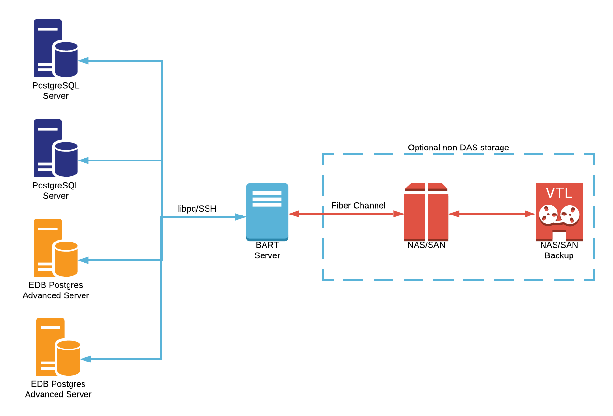

# EDB Reference Architectures

## Backup & Recovery with EDB BART

### When should this architecture be used?

This add-on architecture should be used when you have one or more PostgreSQL or
EDB Postgres Advanced Server instances or clusters that you need to backup for
disaster recovery purposes. Backups can be full restores (i.e. the database
cluster is restored in it's entirety), or Point In Time Recovery (PITR) may be
used to restore the cluster to the state it was in at a specific point in time. 

Having backups should be considered a standard requirement for all databases,
with exceptions being made only when data can be either reconstructed from s
scratch with less effort than restoring a backup, or when data is "throw away",
for example on test or development systems.

It should be noted that techniques for mirroring storage such as with a pair of
SANs is *not* an alternative to having a backup scheme using a technology such
as BART; that may protect against failure of the primary storage, but other
types of data corruption or loss will be mirrored verbatim to the seondary 
storage.

ALWAYS test backups regularly! If backups and the process to restore them are 
not validated on a regular basis, you may unwittingly be putting your data at
risk of total loss.

### Architectural diagram(s)

### What hardware is required?

BART needs to run on a Linux server. It cannot be run on Windows. Depending on
the number of servers being backed up, a dedicated server may be preferred, 
though in smaller installations it's not uncommon to install BART on the 
database servers themselves.

Backups should be made to a reliable and suitably sized storage medium, ideally
either offsite, or with additional backups offsite. For smaller deployments this
may be direct attached or network attached storage on the server hosting BART.
For larger installations, it may be a SAN.

Sizing of storage is dependent on the databases being backed up, retention policy,
and throughput of the databases; BART can perform full and incremental backups.

Under no circumstances should BART backups be stored on the same physical media
as the databases!

### What software is required?

* Any Linux distribution [supported by EDB products](https://www.enterprisedb.com/product-compatibility).
* EDB BART.
* [EDB PEM](edb-pem) (optional, if graphical management, alerting and scheduling 
is required).

### How is this architecture implemented?

1. Install EDB BART on the desired server(s).

2. If BART is to be managed using EDB PEM, follow the [PEM documentation](https://www.enterprisedb.com/edb-docs/d/edb-postgres-enterprise-manager/user-guides/bart-management-features-guide/latest/index.html) to configure PEM with BART.

3. If BART will be managed without the use of PEM, follow the [BART documentation](https://www.enterprisedb.com/edb-docs/p/edb-backup-and-recovery-tool) to configure BART.

### Summary

EDB BART provides protection against disasters, allowing you to restore an 
entire database in the event of a catastrophic hardware failure, or to restore
a database to the state it was in at a particular point in time following 
corruption events, such as the accidental deletion of data.