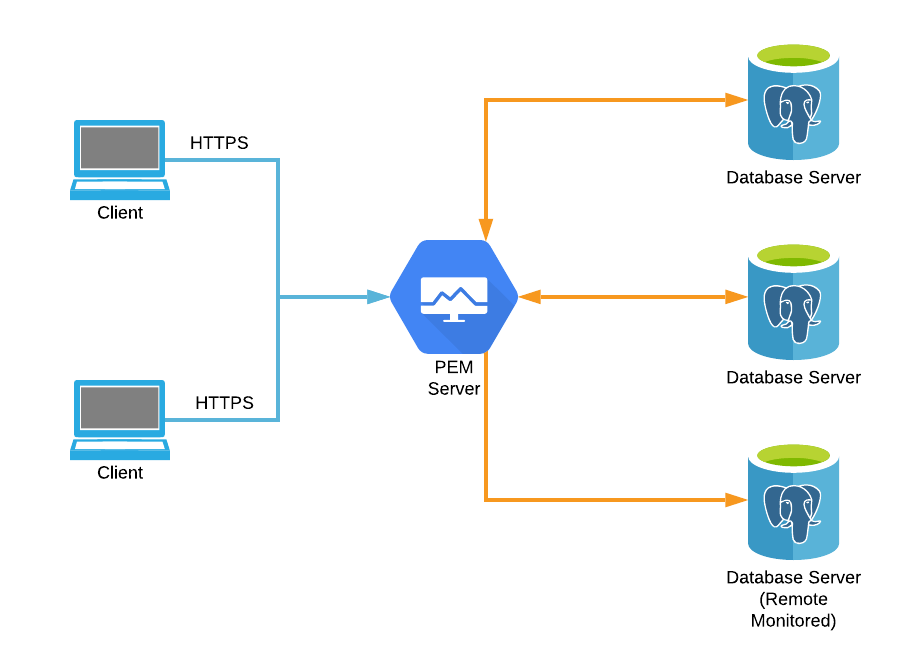

# EDB Reference Architectures

## Monitoring & Management with Postgres Enterprise Manager (PEM)

### When should this architecture be used?

This add-on architecture should be used when you have one or more PostgreSQL or
EDB Postgres Advanced Server instances or clusters that you wish to monitor and
manage.

PEM provides 24x7 monitoring and alerting, as well as a comprehensive set of
tools for managing your database server, including all functionality found in
[pgAdmin](https://www.pgadmin.org/), and:

* Pre-built and self-built dashboards
* Capacity management predictive reporting
* Wait state performance analysis with EDB Postgres Advanced Server
* SQL profiling
* Tuning, logging, and audit logging wizards
* Static deployment analysis and recommendations

### Architectural diagram

### What hardware is required?

One server is typically used to run PEM, though two can be used if separating 
the data storage engine from the web services is desired. A typical starter
installation might use a single server with 4 or more CPU cores, 8GB of RAM and 
500GB of storage for monitoring up to 10 Postgres instances.

It should be noted that hardware requirements can vary significantly based on
the workloads on the servers being managed, as well as the monitoring 
configuration being used (i.e. what metrics are collected, how frequently, and
how long the metrics are stored for). The amount of data collected is also
largely affected by the throughput of the monitored servers rather than the size 
of them. High velocity workloads will typically result in significantly more 
data being stored in the PEM server than low velocity workloads with few 
inserts/updates/deletes (e.g. data warehouses).

### What software is required?

* Any Windows version or Linux distribution 
[supported by EDB products](https://www.enterprisedb.com/product-compatibility).
* PEM Server
* PEM Agent
* A web browser (for the client)

### How is this architecture implemented?

1. Install the PEM Server software on the server.

2. If the PEM Server and servers to be monitored are installed on the same
network, install the PEM Agent on each of the servers you wish to monitor, and
register them with the PEM Server, and then register each of the Postgres 
instances in the PEM web interface and bind them with the agent installed on the
same machine.

3. If the PEM Server and servers to be monitored are not installed on the same
network, remote monitoring mode may be used. Register the Postgres instances 
in the PEM web interface, and bind them with the agent installed on the PEM 
Server.

    In this mode the monitored servers do not need to be able to directly 
connect to the PEM Server, but the PEM Server does need to be able to connect 
to the monitored servers.

Using remote monitoring should be avoided if possible as it will preventing 
monitoring of the underlying system and cause functionality that requires direct 
access to the system to be disabled.

See the [PEM documentation](https://www.enterprisedb.com/edb-docs/p/edb-postgres-enterprise-manager) for full details on installing and configuring 
PEM.

### Summary

EDB PEM provides a wide range of monitoring and management functionality for
Postgres users, and can complement virtually all Postgres deployments.