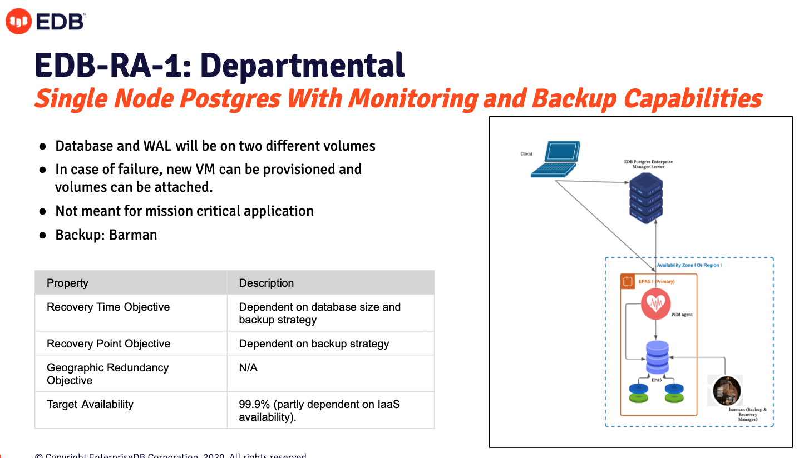
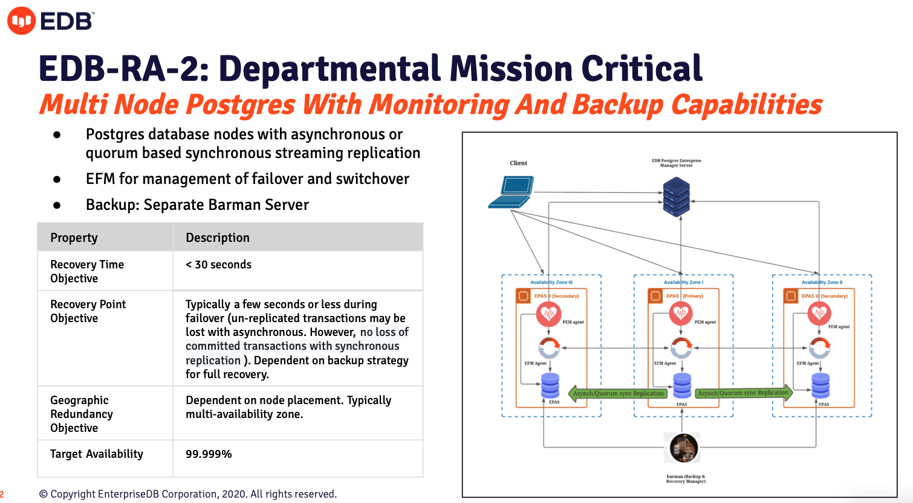
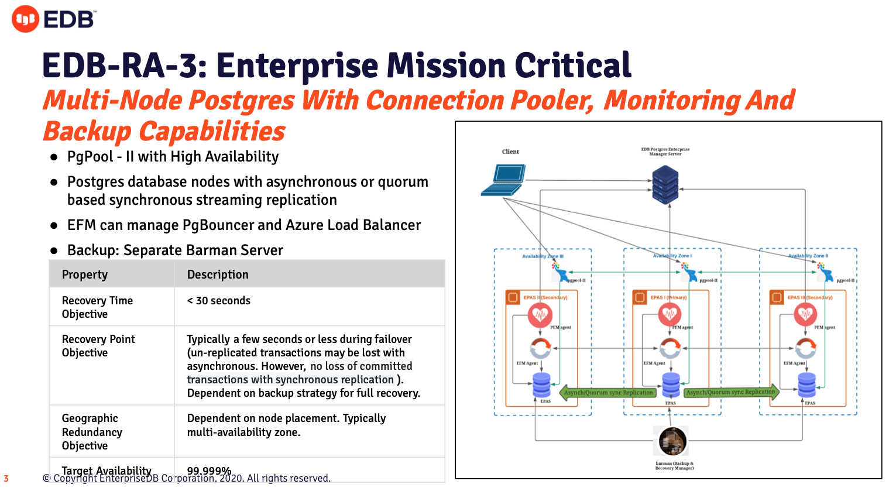

# EDB Reference Architectures supported by edb-deployment tool

## EDB-RA-1: EDB Reference Architecture I

## EDB-RA-2: EDB Reference Architecture II

## EDB-RA-3: EDB Reference Architecture III

