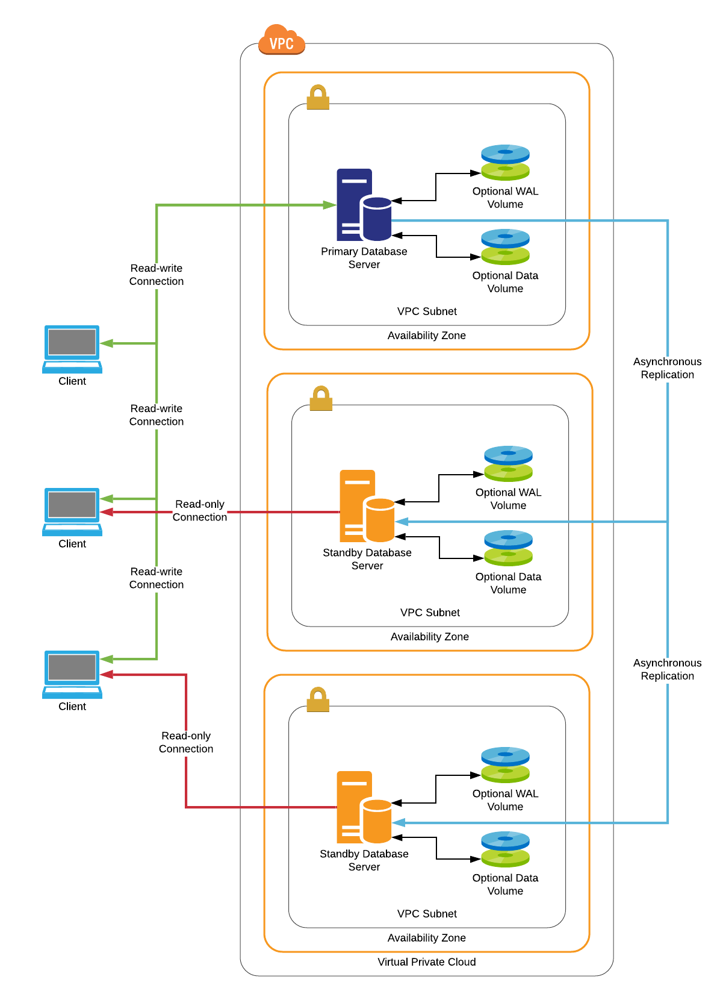

# EDB Reference Architectures

## Multi node database cluster with asynchronous replication

This architecture provides a multi node database cluster with a primary and
one or more standby nodes that run in "HOT standby" mode allowing them to be
used as read-only replicas until such time as they are needed to take over
the primary role.

### When should this architecture be used?

This architecture is suitable for production applications that require a high
level of availability and read scaling.

Property                        | Description
------------------------------- | ----------------------------------------------
Recovery Time Objective         | < 15 seconds
Recovery Point Objective        | Typically a few seconds or less during failover (un-replicated transactions may be lost). Dependent on backup strategy for full recovery.
Geographic Redundancy Objective | Dependent on node placement. Typically multi-availability zone.
Target Availability             | 99.999%

### Architectural diagram

### What hardware is required?

* Two or more servers (minimum of three recommended), physical or virtual
    * 1GB+ RAM
    * 4GB+ Disk
    * 1+ CPU cores

For systems where performance is of a concern, dedicated volumes (preferrably SSD)
may be used for Write Ahead Log (WAL) and optionally database storage. Multiple
dedicated volumes may be arranged in RAID 10 configuration for additional 
performance and storage, and in cloud environments use of dedicated storage IOPs
might be considered. 

### What software is required?

* Any Linux distribution [supported by EDB products](https://www.enterprisedb.com/product-compatibility).
* [PostgreSQL](https://www.postgresql.org/) or 
[EDB Postgres Advanced Server](https://www.enterprisedb.com/products/edb-postgres-advanced-server-secure-ha-oracle-compatible)
* [EDB Failover Manager (EFM)](https://www.enterprisedb.com/products/postgresql-automatic-failover-manager-cluster-high-availability)

### How is this architecture implemented?

#### Overview

1. Two or more physical or virtual machines running Redhat Enterprise or CentOS 
Linux 8 are deployed in the required environment (three or more recommended), 
each in a separate availability zone or VMware cluster, server room etc. If 
deploying into a cloud environment, a Virtual Private Cloud should be employed to segregate the server from the Internet.

2. If using EDB Postgres Advanced Server, visit the 
[EDB Repos](https://repos.enterprisedb.com/) website to configure the EDB
repository and install the database server.

3. If using PostgreSQL, visit the 
[PostgreSQL Download](https://www.postgresql.org/download/linux/) page 
to configure the PostgreSQL repository and install the database server.

4. Modify the _pg_hba.conf_ file on the server to allow access to the database
server from the required IP addresses or subnets.

5. If applicable, modify the firewall rules in the hosting environment to allow
access to the database server fromt he required IP addresses or subnets. If 
running in a Virtual Private Cloud, an elastic IP address for the server may
also be required.

6. Configure asynchronous log based replication between the primary and standby
nodes, per the database server documentation.

7. Install EDB Failover manager by visiting the 
[EDB Repos](https://repos.enterprisedb.com/) website to configure the EDB
repository (if not already done) and following the steps to install EFM.

8. Configure EFM on each node in the cluster per the documentation. EFM can 
manage a virtual IP address for the primary node in physical or VMware 
environments, or may be configured to manage an elastic IP in clould environments
through the use of hook scripts.

9. Use the virtual or elastic IP for connections to the primary database server
in the cluster. Read-only connections such as those used for reporting 
workloads can be directed to any of the servers, provided that it is acceptable 
that queries run on them may be a few transactions behind the primary. The
[pgPool](../pgpool/) add on may be used for load balancing and automated read-only
vs. read-write query routing, though this should be avoided unless there are no
other options available as there are a number of corner cases where it may not
work as intended.

10. Where feasible, design applications such that they have separate database 
connections for read-only and read-write purposes so those can be directed to 
one or more of the standbys or primary server as appropriate. The 
[pgBouncer](../pgbouncer/) add on may be used for load balancing across the
standby servers.

### Summary

The multi node database cluster architecture is primarily useful for production
systems where a small amount of committed transaction loss is acceptable in the
event of a primary failure. Good performance is attainable with appropriate
node sizing and tuning, and read scaling can be implemented through the use of
a suitable number of standby nodes and either application or pooler based 
connection routing.