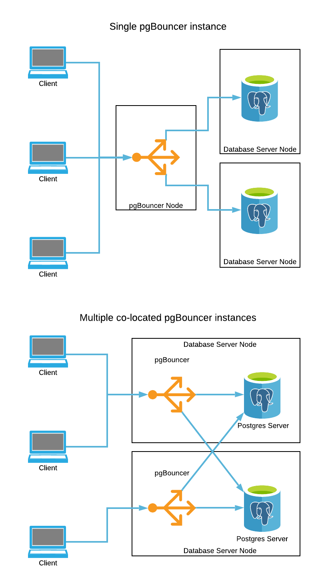

# EDB Reference Architectures

## Add on: load balancing with pgBouncer

pgBouncer can be used to provide pooling and basic load balancing over the top
of a cluster of Postgres servers. Unlike [pgPool](../pgpool/), pgBouncer cannot
route queries based on whether or not they are part of read or read/write
transactions, so this must be handled by the application. pgBouncer can provide
access to multiple databases or servers at once though, so it is possible for
it to be used to pool connections to a primary server whilst simultaneously
pooling and load balancing (for which it uses a round-robin approach to balance
connections across all the nodes to which the hostname for the backend server
resolves) connections to a set of replica servers.

### When should this architecture be used?

When any or all of the following are true, pgBouncer should be considered:

* When connection pooling is required to minimise the number of connections to
a Postgres database server.
* When the application can manage routing of read or read/write queries to 
the appropriate database itself.
* When load balancing across a number of read-only servers.

### Architectural diagrams

### What hardware is required?

pgBouncer may be installed on a dedicated node (or nodes), or colocated with the
database server instances. If using multiple instances of pgBouncer for high 
availibility, consider using a virtual IP address, DNS, or other techniques to
ensure connections are only routed to the active instances.

### What software is required?

* Any Windows version or Linux distribution 
[supported by EDB products](https://www.enterprisedb.com/product-compatibility).
* pgBouncer

### How is this architecture implemented?

1. Decide where you wish to install pgBouncer.

2. If installing on Windows, use the StackBuilder or StackBuilder Plus 
application to download and install pgBouncer.

3. If installing with EDB Postgres Advanced Server on Linux, visit the 
[EDB Repos](https://repos.enterprisedb.com/) website to configure the EDB 
repository and install pgBouncer.

4. If installing with PostgreSQL on Linux, visit the 
[PostgreSQL Download](https://www.postgresql.org/download/linux/) page 
to configure the PostgreSQL repository and install pgBouncer.

5. Follow the [pgBouncer documentation](https://www.pgbouncer.org/)
to configure pgBouncer to connect to the backend database servers as required,
and to authenticate incoming connections.

### Summary

pgBouncer may be used as a connection pooler to minimise backend startup cost
and the number of connections to a Postgres server, and to provide basic 
load balancing over a number of Postgres servers. Query routing must be 
handled by the application, if required.