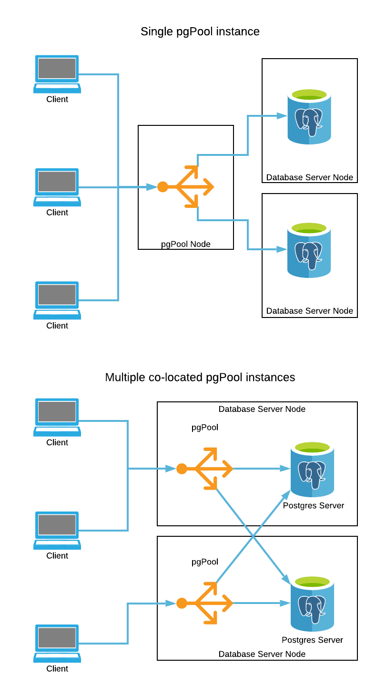

# EDB Reference Architectures

## Add on: load balancing and query routing with pgPool

pgPool can be used to provide pooling and load balancing over the top
of a cluster of Postgres servers. Unlike [pgBouncer](../pgbouncer/), pgPool is
able to route queries based on whether or not they are part of read or 
read/write transactions, making pgPool useful in situations where the application
cannot do this itself.

It is important to note that pgPool parses queries to understand whether or not
they are going to cause writes to the database or not. This may not work 
correctly if the writes are hidden inside stored procedures, views or similar
objects that may actually be called through a SELECT query. You should ensure
your application will not be affected by this behaviour before using pgPool to 
handle read vs. read/write query routing.

### When should this architecture be used?

When any or all of the following are true, pgPool should be considered:

* When the application cannot manage routing of read or read/write queries to 
the appropriate database itself.
* When load balancing across a number of read-only servers, and you want to be 
able to add/remove servers on the fly without having to update DNS zonefiles or
similar.

### Architectural diagrams

### What hardware is required?

pgPool may be installed on a dedicated node (or nodes), or colocated with the
database server instances. If using multiple instances of pgPool for high 
availibility, consider using a virtual IP address, DNS, or other techniques to
ensure connections are only routed to the active instances.

### What software is required?

* Any Linux distribution 
[supported by EDB products](https://www.enterprisedb.com/product-compatibility).
* pgPool

### How is this architecture implemented?

1. Decide where you wish to install pgPool.

2. If installing with EDB Postgres Advanced Server on Linux, visit the 
[EDB Repos](https://repos.enterprisedb.com/) website to configure the EDB 
repository and install pgPool.

3. If installing with PostgreSQL on Linux, visit the 
[PostgreSQL Download](https://www.postgresql.org/download/linux/) page 
to configure the PostgreSQL repository and install pgPool.

4. Follow the [pgPool documentation](https://www.pgpool.net/)
to configure pgPool to connect to the backend database servers as required,
and to authenticate incoming connections.

### Summary

pgPool may be used as a connection pooler to minimise backend startup cost
and the number of connections to a Postgres server, and to provide 
load balancing with automatic query routing over a number of Postgres servers.
