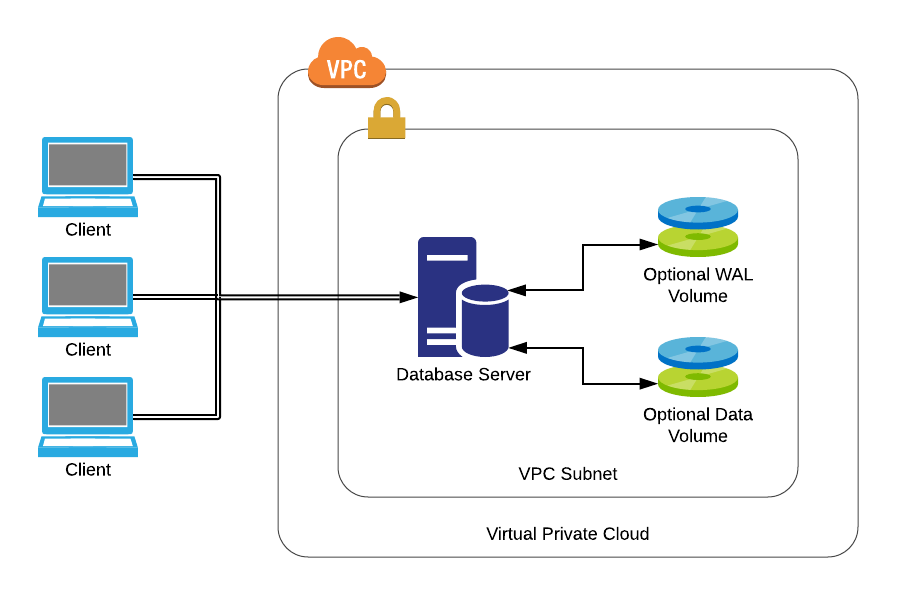

# EDB Reference Architectures

## Single node database server

This architecture provides a simple single node database server that's easy
to provision and maintain.

### When should this architecture be used?

This architecture should not typically be used for production systems or anything
considered business critical. It is primarily intended for use in development
and test environments where high availability is not a concern.

Property                        | Description
------------------------------- | ----------------------------------------------
Recovery Time Objective         | Dependent on database size and backup strategy
Recovery Point Objective        | Dependent on backup strategy
Geographic Redundancy Objective | N/A
Target Availability             | 99.9%

### Architectural diagram(s)

### What hardware is required?

* One server, physical or virtual
    * 1GB+ RAM
    * 4GB+ Disk
    * 1+ CPU cores

For systems where performance is of a concern, dedicated volumes (preferrably SSD)
may be used for Write Ahead Log (WAL) and optionally database storage. Multiple
dedicated volumes may be arranged in RAID 10 configuration for additional 
performance and storage, and in cloud environments use of dedicated storage IOPs
might be considered. 

### What software is required?

* [Red Hat Enterprise](https://www.redhat.com/en/technologies/linux-platforms/enterprise-linux) 
or [CentOS](https://www.centos.org/) Linux
* [PostgreSQL](https://www.postgresql.org/) or 
[EDB Postgres Advanced Server](https://www.enterprisedb.com/products/edb-postgres-advanced-server-secure-ha-oracle-compatible)

### How is this architecture implemented?

#### Overview

1. A physical or virtual machine running Redhat Enterprise or CentOS Linux 8 is 
deployed in the required environment. If deploying into a cloud environment, a 
Virtual Private Cloud should be employed to segregate the server from the 
Internet.

2. If using EDB Postgres Advanced Server, visit the 
[EDB Repos](https://repos.enterprisedb.com) website to configure the EDB Yum
repository and install the database server.

3. If using PostgreSQL, visit the [PostgreSQL Download](https://www.postgresql.org/download/linux/redhat) page to configure the PostgreSQL Yum repository and 
install the database server.

4. Modify the _pg_hba.conf_ file on the server to allow access to the database
server from the required IP addresses or subnets.

5. If applicable, modify the firewall rules in the hosting environment to allow
access to the database server fromt he required IP addresses or subnets. If 
running in a Virtual Private Cloud, an elastic IP address for the server may
also be required.

#### Scripts & Tools

Scripts and tools to deploy this architecture are provided in this repository:

* [Ansible](ansible/)
* [Shell scripts](shell-scripts/)
* [Terraform](terraform/)

### Summary
